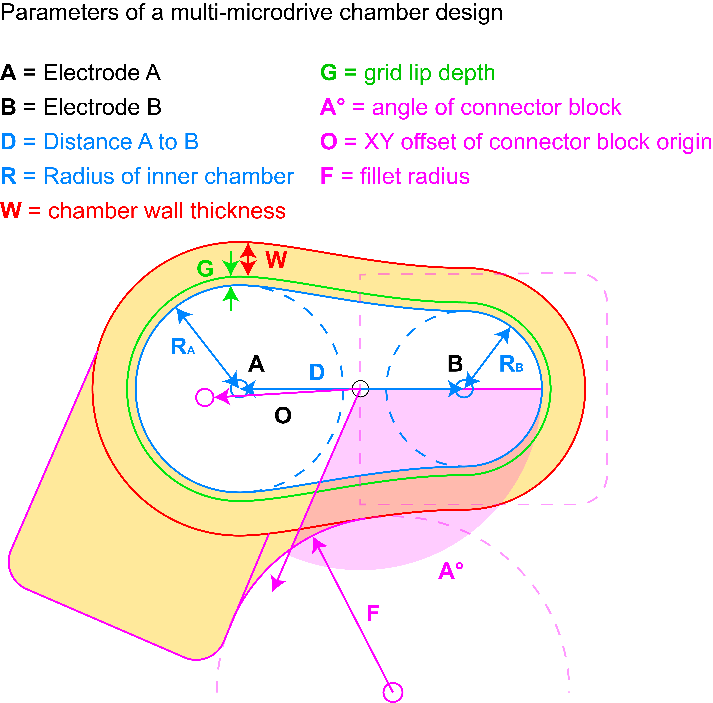

.. _FreeCAD:

======================
:fa:`python` FreeCAD
======================

Dual Chamber Parameters
==============================

To accelerate and simplify the process of designing custom chambers for chronic electode recording implants using FreeCAD, the design of these chambers can be constrained and parameterized. The Python script `GenerateDualChamber.py <https://github.com/Phenomenal-Cat/IGNITE/blob/main/FreeCAD/GenerateDualChamber.py.FCMacro>`_ functions as a macro