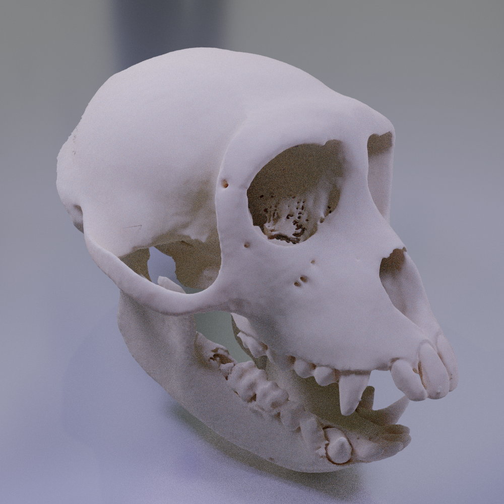

.. _ImageProcessing:

=========================================
:fa:`brain` Image processing
=========================================

Anatomical 3D imaging of the brain and head can be extremely useful for planning various types of surgical interventions. The tools described below harness the power of :bdg-link-success:`3D Slicer <https://www.slicer.org>` via Python scripting, to streamline certain processes that facilitate surgical planning.

.. contents:: :local:

:fa:`brain` Imaging data acquisition
======================================

.. _Stereotax:

Stereotaxes
---------------

The `Horsley-Clarke stereotaxic frame <https://en.wikipedia.org/wiki/Stereotactic_surgery#History>`_ was invented over a century ago, but continues to be the primary method of stabilizing and orienting the head of anesthetized animals during surgical procedures. The basic design utilizes four points of contact with bony anatomical landmarks of the skull, to define a horizontal plane known as the 'Frankfurt plane'. These points are the external auditory meatus (or `ear canal <https://en.wikipedia.org/wiki/Ear_canal>`_) and the `infraorbital margin <https://en.wikipedia.org/wiki/Infraorbital_margin>`_ (bilaterally). Additionally, a palette bar applies upward pressure on the `palatine process of maxilla <https://en.wikipedia.org/wiki/Palatine_process_of_maxilla>`_, in order to push the infraorbital margins up into the stereotax orbit bars.

Modern commercial producers of stereotaxic frames include Kopf Instruments, who produce MRI compatible models (e.g. `1430M <https://kopfinstruments.com/product/model-1430m-mri-stereotaxic-instrument/>`_), and **Jerry Rig**. 

.. dropdown:: :fa:`server` Data import module for |NIF_Import| users
	:color: info
	:chevron: down-up
	:class-body: sd-bg-secondary sd-text-dark

	.. image:: _images/Screenshots/Slicer/NIF_Import_Module.png
		:width: 30%
		:align: right

	A Slicer module named :bdg-link-primary:`NIF_Import <https://github.com/Phenomenal-Cat/IGNITE/tree/main/Slicer/IGNITE/NIF_Import>` is provided specifically for researchers at NIH who use the `Neurophysiology Imaging Facility (NIF) Core <https://www.nimh.nih.gov/research/research-conducted-at-nimh/research-areas/research-support-services/nif>`_ to acquire their imaging data. It requires the user's computer to be connected to the NIH network, and to have the NIFVAULT network storage volume mounted. Users on the NIH network can access information on how to do this via the `NIF's intranet documentation site <https://nif.nimh.nih.gov/doc/NIF-DataAccess.html#nifvault-server>`_.

	To use the :bdg-link-primary:`NIF_Import <https://github.com/Phenomenal-Cat/IGNITE/tree/main/Slicer/IGNITE/NIF_Import>` module, type a subject's name or ID in the :bdg-success:`Subject name / ID` field. The module will then search NIFVAULT's DICOM directories for MRI and CT data folders that contain matching strings, and list the session dates of any data it finds in the :bdg-success:`MRI session` and :bdg-success:`CT session` fields below. The user should select a single session for each modality and the module will then locate appropriate volumes within each session folder, to load into the viewer via SLicer's :bdg-link-primary:`DICOM <https://slicer.readthedocs.io/en/latest/user_guide/modules/dicom.html>` module. 

	Optionally, the following processes can be applied after importing the selected volumes:

		- :bdg-success:`Apply de-sphinx rotation?` - This is checked by default, and should always be used for raw DICOM data coming from the NIF's Siemens Prisma 3T MRI scanner.
		- :bdg-success:`Initialize stereotax control points?` - Checking this box will generate an initial set of control points within Slicer's :bdg-link-primary:`Markups <https://slicer.readthedocs.io/en/latest/user_guide/modules/markups.html>` module, which can be manually positioned to define the Frankfurt plane of stereotaxic coordinate system (see below).
		- :bdg-success:`Export skull surface?` -  Checking this box will generate an initial segmentation using Slicer's :bdg-link-primary:`Segmentations <https://slicer.readthedocs.io/en/latest/user_guide/modules/segmentations.html>` of the selected CT volume that aims to separate bone from air and tissue. 

:fa:`ruler-combined` Aligning MRI volumes to stereotaxic space
=====================================================================

1. Localize stereotaxic frame
------------------------------------------

2. Calculate and apply transform
------------------------------------------

:fa:`object-ungroup` Cross-modal volume alignment
======================================================

:fa:`skull` Creating a skull model
=========================================

Implanted neural hardware typically involves an anchor point on the skull surface, even if the parts in contact with the brain are 'floating'. There are several advantages to generating a skull model for each individual subjects including customization of implant hardware to specific skull surface contours.

.. container:: clearer

    .. image :: _images/spacer.png
       :width: 1

Segmenting skull from MRI?
------------------------------

.. dropdown:: :octicon:`info` **Why use CT rather than MRI?**
  :open:
  :color: primary
  :chevron: down-up

  Magnetic resonance imaging :bdg-info:`MRI` and Computed tomography :bdg-danger:`CT` volumes contain very different tissue contrasts, as shown in the example coronal slice images below. CT has relatively low contrast for different tissue types but has excellent contrast between bone and soft tissue. Bone in a T1-weighted MRI on the other hand has a range of intensities that overlap with that of air, which makes it more difficult to segment via thresholding. Additionally, CT scans tend to be higher resolution. In the images below, the MRI has 0.5mm isotropic voxels and took ~30 minutes to acquire, while the CT has 0.2mm isotropic voxels and took ~1 minute to acquire. **It is therefore recommended to acquire a CT of the subject when possible** (in addition to anatomical MRIs), for use in skull reconstruction process. If for some reason you needed to reconstruct a skull from MRI data, it is still possible but requires more manual intervention and the end result will be less accurate than with CT. The interactive 3D models embedded below demonstrate this difference. 

	.. grid:: 2
		:gutter: 2
		:margin: 0
		:padding: 0

		.. grid-item-card::
   			:margin: 0
   			:columns: 6
   			:class-card: sd-bg-secondary sd-text-white sd-rounded-3 sd-border-0
   			:class-header: sd-bg-info sd-rounded-3
   			:class-footer: sd-bg-dark

			:fa:`magnet` **MRI**
			^^^^^^

			.. image:: _images/Guides/SkullSegmentation/ImageContrast_MRI.png
				:align: center
				:width: 400

			+++++
			.. raw:: html

				<iframe title="MRI Skull Decimated" frameborder="0" allowfullscreen mozallowfullscreen="true" webkitallowfullscreen="true" allow="fullscreen; autoplay; vr" xr-spatial-tracking execution-while-out-of-viewport execution-while-not-rendered web-share width="300" height="200" src="https://sketchfab.com/models/704648e9e4224e7fa14eae38f407bfa0/embed?autospin=0.5&autostart=1&ui_theme=dark"> </iframe>

			- **Scanner:** 			Siemens Prisma 3T
			- **Voxel size:**		0.5 mm  isotropic
			- **Scan duration:**	~30 minutes
			- **Reconstruction:**	Manual

		.. grid-item-card::
			:margin: 0
			:columns: 6
			:class-card: sd-bg-secondary sd-text-white sd-rounded-3 sd-border-0
			:class-header: sd-bg-danger sd-rounded-3
			:class-footer: sd-bg-dark

			:fa:`radiation` **CT**
			^^^^^^

			.. image:: _images/Guides/SkullSegmentation/ImageContrast_CT.png
				:align: center
				:width: 400

			+++++
			.. raw:: html

				<iframe title="CT_Skull_decimated" frameborder="0" allowfullscreen mozallowfullscreen="true" webkitallowfullscreen="true" allow="fullscreen; autoplay; vr" xr-spatial-tracking execution-while-out-of-viewport execution-while-not-rendered web-share width="300" height="200" src="https://sketchfab.com/models/30c5d657f68e47f99befd2a5a2c2889e/embed?autospin=0.5&autostart=1&ui_theme=dark"> </iframe>

			- **Scanner:** 			Epica Vimago CT
			- **Voxel size:**		0.2 mm  isotropic
			- **Scan duration:**	<1 minute
			- **Reconstruction:**	Automated

	The video below demonstrates how to segment a skull surface from a T1-weighted MRI using 3D Slicer. Note that this process requires the :bdg-link-primary:`SurfaceWrapSolidify <https://github.com/sebastianandress/Slicer-SurfaceWrapSolidify>` extension, which can be easily installed via the :bdg-link-primary:`Extensions Manager <https://slicer.readthedocs.io/en/latest/user_guide/extensions_manager.html>` wizard.

  	.. raw:: html

  		<iframe src="https://nih.app.box.com/embed/s/oo29puywnshxnlsda2xegnsfugvc080m?sortColumn=date&view=list" width="600" height="450" frameborder="0" allowfullscreen webkitallowfullscreen msallowfullscreen></iframe>

