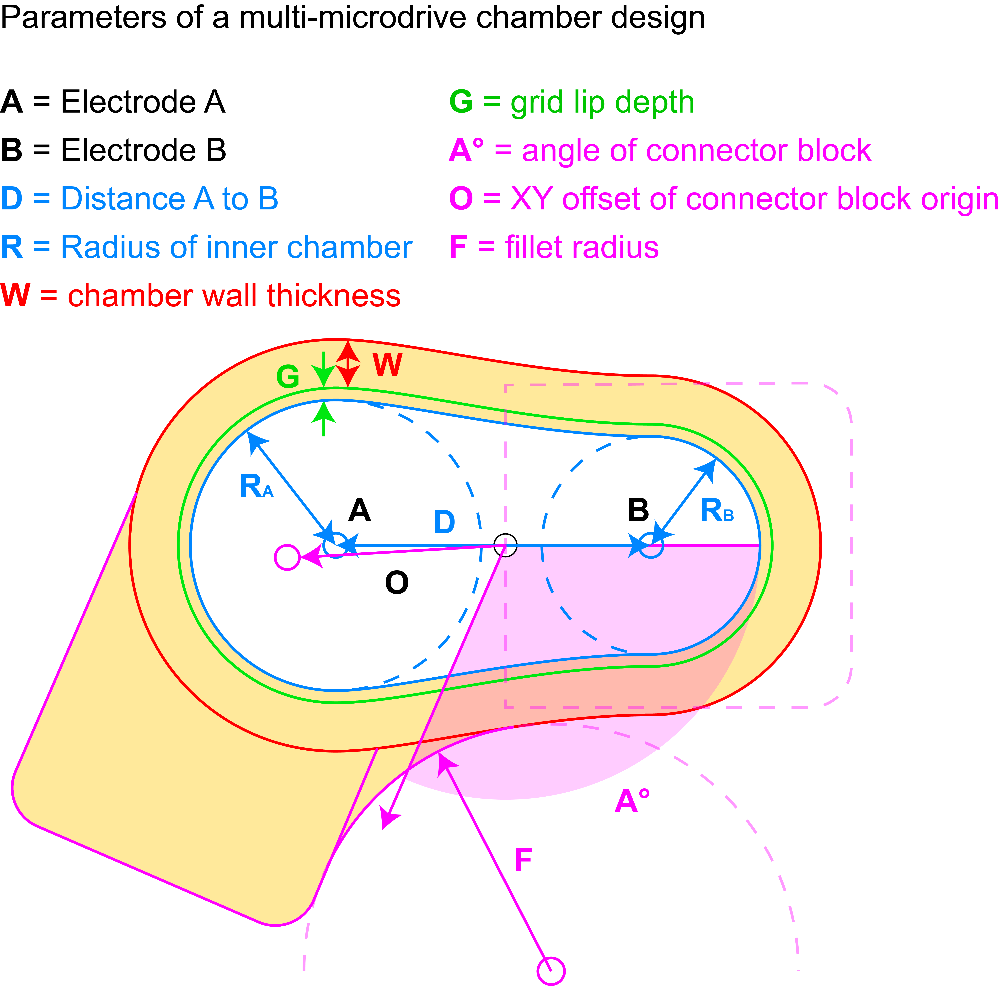

.. _ImplantDesign:

================================================
:fa:`ruler-combined` Implant design
================================================

In contemporary experimental neuroscience there are a range of neural recording and stimulation techniques that require the surgical implantation of hardware. These range from micro-electrode recordings of extracellular action potentials ('spikes'), electrocorticography (ECoG) arrays measuring local field potentials (LFPs) at teh cortical surface, optical imaging (e.g. Calcium, 2-photon) and stimulation (optogenetics, NIR) 
- :fa:`bolt-lightning` Electrical stimulation ()

- :fa:`road-spikes` micro-electrode recordings (:ref:`Microwire brush arrays <MicrowireArrays>`, `NeuroPixels <https://www.neuropixels.org/>`_, `Utah arrays <https://blackrockneurotech.com/products/utah-array/>`_, etc.)
- :fa:`grip-vertical` :fa:`grip-vertical` Electrocorticography (ECoG) arrays
- :fa:`bolt-lightning` Electrical stimulation ()
- :fa:`microscope` optical imaging (`Calcium <https://www.mightexbio.com/products/oasis/oasis-implant/>`_, 2-photon, )
- :fa:`lightbulb` optical stimulation (NIR, )
- :fa:`syringe` chemical stimulation

Common to all of these methods is the need for any implanted hardware to be minimally disruptive of the subjects' normal behavior (e.g. minimizing size and weight and optimizing form factor), safe for long periods (e.g. mechanically robust, biocompatible, minimizing risk of infections).

Dual Chamber Parameters
==============================

Dual Chamber Parameters
==============================

To accelerate and simplify the process of designing custom chambers for chronic electode recording implants using FreeCAD, the design of these chambers can be constrained and parameterized. The Python script `GenerateDualChamber.py <https://github.com/Phenomenal-Cat/IGNITE/blob/main/FreeCAD/GenerateDualChamber.py.FCMacro>`_ functions as a macro