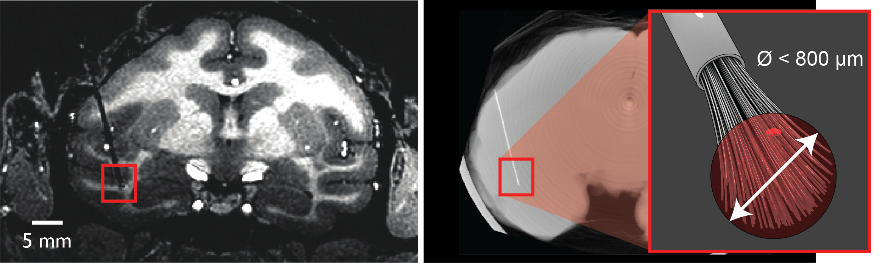

.. _MicrowireArrays:

==============================================
:fa:`microscope` Chronic Electrode Implants
==============================================

.. contents:: :local:

.. card::
  :columns: 12
  :header: bd-primary text-bold p-1 pl-2
  :body: bg-light border-0 p-2

  :opticon:`info,mr-1` **Note**
  ^^^^^^^^^^^^^^^^^^^^^^^^
  The Ide-McMahon microdrive design was the SCNI's first generation of chronically implanted micro drive hardware for use with MBAs. However, development of implant designs and procedures is ongoing. Information on the Ide-McMahon design is provided here for reference, but the system now used for MBA implants in the SCNI is the :ref:`MIDAS system <Microdrive_MIDAS>`, which offers numerous improvements.

:fa:`circle-info` Background
================================

*In vivo* extracellular recording of neuronal action potentials ('spikes') have been used in research to obtain a view of brain activity at the cellular level for many decades (Renshaw, Forbes & Morrison, 1940; Hubel & Weisel, 1959). 

*Chronically implanted* electrodes offer the ability to record extracellular neuronal action potentials (‘spikes’) in vivo, over longer time periods (`Schmidt et al., 1978 <https://doi.org/10.1016/0014-4886(78)90252-2>`_).

:fa:`broom` Microwire Brush Array (MBA) Electrodes
====================================================

  Coronal MR image and micro-CT showing an implanted chronic microwire multielectrode and an illustration of the 'brush' tip (MR image courtesy of McMahon et al., 2014).

Microwire 'brush' array electrodes have been independently developed by multiple research laboratories. The variety that are currently commercially manufactured by `MicroProbes <https://microprobes.com/images/products/mc/mba/>`_ were originally developed at the University of Freiburg (`Bondar et al., 2009 <http://journals.plos.org/plosone/article?id=10.1371/journal.pone.0008222>`_; `Krüger et al., 2010 <https://doi.org/10.3389/fneng.2010.00006>`_) and further developed at the National Institutes of Health (:ref:`McMahon et al., 2014 <McMahon2014>`) over the past decade. 

The concept is to take a bundle of insulated microwires and insert them into the brain through a guide tube. As the electrode tip is lowered, the individual wires splay out in the tissue, allowing for stable isolation of extracellular spiking activity for a local population of neurons over long time periods (many months). Each microwire consists of a nickel-chromium-aluminum core of 12.5 µm diameter, insulated with polyimide by the manufacturer (`IsaOhm®, Isabellenhüete <https://www.isabellenhuette.de/en/precision-alloys/products/isaohmr>`_, Germany). These electrodes are currently commercially available from `MicroProbes (MD) <https://microprobes.com/products/multichannel-arrays/mba>`_ in lengths from 2.5 mm to 120 mm. 

.. _MBA_TipDev_

Microwire brush tip development notes
-----------------------------------------

  **Figure 3.** Simulations of microwire brush tip trajectories in tissue. Columns show different brush tip preparations. Top row shows the state of the array tip prior to insertion in the guide tube. The second and third rows show the gradual deflection of individual microwires with distance emerged from the guide tube tip. (Figure courtesy of :ref:`Dr. Kenji Koyano <kwk>`). 

In order to improve the cell yield per implant, we attempted moving from 64-channel bundles to 128-channel bundles several years ago. However, our experience was that 128-channel bundles do not produce comparable yield to 64-channel bundles, possibly due to the mechanical properties of the increased bundle size. We subsequently reverted to using 64-channel bundles, but also miniaturized the microdrive design in order to obtain between 128-256 channels per implant using multiple 64-channel bundles.

During our tests to discern why the 128-channel bundles might not be working as well as we had hoped, Dr Kenji Koyano performed a series of tests, producing microwire bundles with a variety of tip designs, and inserting them into gelatin as a simulated brain tissue medium. His observations of how the individual microwires deflect upon entering the gelatin are shown here (Figure 3). The results suggest that a non-flat tip shape and active pre-splaying of the wires prior to insertion in the guide tube both improve splaying of the wires in tissue. 

Microprobes MBA Order Specifications
-----------------------------------------

.. figure:: _images/Guides/MBAs/MBA_Specifications.png
  :align: right
  :width: 100%
  :figwidth: 40%

When ordering MBAs from `MicroProbes for Life Sciences <https://microprobes.com/images/products/mc/mba/>`_, you will need to provide certain specifications. The figure to the right illustrates typical specifications for SCNI MBA orders. Important factors to consider include:

-  **Connectors**. Nickel-free `Omnetics 32-channel, 36-pin nano-connectors <https://www.omnetics.com/products/neuro-connectors/nano-strip-connectors>`_ are preferred for connecting with existing SCNI and NIF eletrophysiolpogy headstages, MRI-compatibility and for minimizing footprint on the implant. If the connectors will be housed in a 3D-printed casing (see information on :ref:`chronic microdrives <chronicMicrodrives>` below) then it is important to specify to MicroProbes that the epoxy reinforcing the wires at the connector should not protrude beyond the extent of the connector block itself.

- **Lengths**: Total electrode shaft length should be determined by target distance and planned implant trajectory. For electrodes implanted vertically in stereotaxic coordinates and targeting ventral visual stream areas, the SCNI typically have used the following lengths: 50 - 60mm: middle and anterior fundus of STS; 65 - 75mm: ventral surface of IT, AMTS, perirhinal cortex, amygdala. Additional typical lengths specified include:

  - Tip length: 5mm
  - Flexible cable length: 40mm
  - Flexible cable per connector: 10mm
  - Sliver ground wires (1 per connector): 100mm

- **Materials**: MicroProbes offer two material choices of microwire: Nickel-Chromium (NiCr20AISi) and Platinum-Iridium (PlIr). The SCNI has always used Nickel-Chromium (`IsaOhm(R), Isabellenhuette, Germany <https://www.isabellenhuette.de/fileadmin/Daten/Praezisionslegierungen/Datenblaetter_Widerstand/Englisch/ISAOHM.pdf>`_). 

.. _chronicMicrodrives: 

:fa:`ruler-vertical` Chronic Implanted Microdrives
=======================================================

Ide-McMahon Microdrive
-------------------------------

.. image:: _images/spacer.png
  :width: 1

This original design for a chronically implantable microdrive was conceived at NIH by David Ide (`Section on Instrumentation <https://www.nimh.nih.gov/research/research-conducted-at-nimh/research-areas/research-support-services/section-on-instrumentation/index.shtml>`__) and David McMahon (SCNI), and was published in `McMahon et al., 2014 <https://www.physiology.org/doi/10.1152/jn.00052.2014>`_. The original drive design consists of three `polyetherimide (PEI / Ultem) <https://en.wikipedia.org/wiki/Polyetherimide>`_ disks, stacked on three ceramic rods, with a single central `Polyether ether ketone (PEEK) <https://en.wikipedia.org/wiki/Polyether_ether_ketone>`_ drive screw. Turning the drive screw (accessible from the top of the drive) advances or retracts the central drive disk, to which the electrode shaft is clamped. The drive mounts to a cylindrical (19mm diameter) PEI chamber base via two nylon screws, and is protected by an PEI cap, which attaches via four brass set screws. 

The microdrive is intended for use with a single :ref:`microwire brush array <mba>`, as described by McMahon et al (2014) and currently sold by `MicroProbes <https://microprobes.com/products/multichannel-arrays/mba>`_. The system is is entirely MR-compatible, provided that nickel-free Omnetics connectors are used in electrode construction.

  **Figure 1**. Photograph and illustration of the original microdrive design (with permission from `McMahon et al. (2014) <https://www.physiology.org/doi/10.1152/jn.00052.2014>`_).

The original design was CNC machined from Ultem rods by the `Section on Instrumentation <https://www.nimh.nih.gov/research/research-conducted-at-nimh/research-areas/research-support-services/section-on-instrumentation>`_ at NIH. Since the design was published, it is now also manufactured by `Hybex Innovations <http://hybex.com/portfolio/chronic-microdrive/>`_ and commercially available from `Rogue Research <https://www.rogue-research.com/veterinary/tools-implants/>`_ with minor modifications, and retails for $742.00 each. As a lower cost alternative, we also provide .stl files for 3D-printing this microdrive `here <https://www.thingiverse.com/thing:3501708>`__, and a list of additional parts needed for assembly is provided below. However, researchers interested in 3D-printed microdrives are advised to check out our newer designs that are more compact, require less user finishing and assembly, and offer several other improvements.
   

.. link-button:: https://www.thingiverse.com/thing:3501708
    :type: url
    :text: Download CAD files
    :classes: btn-success

.. csv-table:: 
  :file: _static/CSVs/SCNI_IdeMcMahon_MicrodriveBOM.csv
  :widths: auto
  :header-rows: 1
  :align: left

:fa:`notes-medical` Surgical Implantation Procedure
======================================================

The panel below provides an illustrated step-by-step overview for the typical surgical procedure of implanting the Ide-McMahon microdrive system with a single pre-loaded MBA electrode. 

	
.. tabs::

	.. tab:: 1. Mark locations

    	.. image:: _images/Guides/MBAs/IdeMcMahon_ImplantProcedure/Slide1.png
        	:align: right
        	:width: 100%

    	- Clean the skull surface
      	- Position chamber using stereotax
      	- Check clearance from headpost (with attachment)
      	- Mark chamber location
      	- Mark screw locations

    .. tab:: 2. Drill skull

      	.. image:: _images/Guides/MBAs/IdeMcMahon_ImplantProcedure/Slide2.png
        	:align: right
        	:width: 100%

      	- Drill and tap screw holes
      	- Insert ceramic screws
      	- Mark craniotomy location by lowering guide tube and stylet in stereotax
      	- Drill craniotomy

    .. tab:: 3. Insert guide tube

      	.. image:: _images/Guides/MBAs/IdeMcMahon_ImplantProcedure/Slide4.png
        	:align: right
        	:width: 100%

      	- Lower guide tube and stylet on stereotaxic arm
      	- Stop at appropriate target depth
      	- Fill in the craniotomy around the guide tube with bone wax
      	- Coat the bone surface with Copalite varnish to seal it

    .. tab:: 4. Place chamber

      	.. image:: _images/Guides/MBAs/IdeMcMahon_ImplantProcedure/Slide5.png
        	:align: right
        	:width: 100%

      	- Slide the chamber down over the guide tube
      	- Position the chamber base against the skull surface
      	- Apply a thin layer of dental acrylic between the skull and the chamber

    .. tab:: 5. Build acrylic cap

      	.. image:: _images/Guides/MBAs/IdeMcMahon_ImplantProcedure/Slide6.png
        	:align: right
       	 	:width: 100%

      	- Build up the dental acrylic around the chamber to cover the screws
      	- Ensure that acrylic does not impede attachment of the cap
      	- Make the contour of the acrylic as smooth as possible

    .. tab:: 6. Remove the stylet

      	.. image:: _images/Guides/MBAs/IdeMcMahon_ImplantProcedure/Slide7.png
        	:align: right
        	:width: 100%

      	- Fix the guide tube in place with a small drop of glue
      	- Once glue is dry, slowly remove the stylet
      	- Cut the top of the guide tube diagonally, just below the top of the chamber

    .. tab:: 7. Insert the electrode

      	.. image:: _images/Guides/MBAs/IdeMcMahon_ImplantProcedure/Slide8.png
        	:align: right
        	:width: 100%

      	- Mount the electrode (loaded into the microdive) onto the stereotaxic arm
      	- Lower the electrode until the tip approaches the guide tube
      	- Tie a loose loop of vicryl suture around the tip of the brush, to reduce the splay
      	- See :ref:`detailed description of electrode insertion procedure <MBA_insertion>` below.

    .. tab:: 8. Lower the drive

      	.. image:: _images/Guides/MBAs/IdeMcMahon_ImplantProcedure/Slide9.png
        	:align: right
        	:width: 100% 

      	- Carefully lower the brush tip just below the top of the guide tube
      	- Move the electrode in the M-L or A-P direction to get the wires into the diagonal cut
      	- Lower until the microdrive is seated on the chamber

    .. tab:: 9. Secure microdrive

      	.. image:: _images/Guides/MBAs/IdeMcMahon_ImplantProcedure/Slide10.png
       	 	:align: right
        	:width: 100% 

      	- Insert nylon screws to fix microdrive firmly to the chamber
      	- Fill in around the guide tube-electrode interface with Kwik-Cast silicone

    .. tab:: 10. Advance microdrive

      	.. image:: _images/Guides/MBAs/IdeMcMahon_ImplantProcedure/Slide11.png
        	:align: right
        	:width: 100%

      	- Turn the drive screw to lower the electrode
      	- Lower until the electrode tip is <1mm inside the guide tube
      	- Further electrode advancement should be done during neural recording

    .. tab:: 11. Secure cap

      	.. image:: _images/Guides/MBAs/IdeMcMahon_ImplantProcedure/Slide12.png
       		:align: right
        	:width: 100%

      	- Lower cap over microdrive 
      	- Run electrode wire under cap through wire channel in chamber
      	- Secure the cap with set screws (careful not to press on wire)
      	- Attach electrode connectors in dental acrylic

.. _MBA_insertion:

MBA Electrode Insertion Procedure
---------------------------------------

.. image:: _images/spacer.png
  :width: 1

.. tab:: Step 1

  i) The stainless steel stylet should be prepared with a pointed but dull tip, and a collar (made from the guide tube material) glued to it just above the top of the guide tube. The stylet should be threaded through the chamber before being attached to the stereotaxic arm. Use tape to hold the chamber in place at the top of the stylet during insertion.
  ii) Using the stereotaxic arm, lower the guide tube with the stainless steel stylet inside, through the craniotomy and along the planned trajectory to the calculated depth.
  iii) Plug the craniotomy around the guide tube with bone wax.

.. tab:: Step 2

  i) Remove the tape holding the chamber in place and gently lower the chamber down to the skull surface. Apply a thin coat of dental acrylic around the craniotomy and position the chamber on it. Fill any gaps under the chamber and build up dental acrylic around the external chamber walls, being careful not to go above the line where the chamber cap will sit.
  ii) Fill the chamber with Kwik-Cast silicone to minimize air pockets within the implant that might allow bacteria to harbour.

.. tab:: Step 3

  i) Holding the top of the guide tube in place with forceps, gently remove the stainless steel stylet.
  ii) Using sharp scissors, make a diagonal cut across the guide tube, just below the level of the chamber top.

.. tab:: Step 4

  i) With the MBA pre-loaded into the microdrive, and the microdrive attached to the stereotaxic arm, slowly lower the arm until the brush tip of the MBA is just above the guide tube.
  ii) Carefully tie a loop of Vicryl suture around the MBA shaft and gently slide it down to the brush tip. Tighten it until the splayed microwires of the brush are pulled closer together.
  iii) Position the MBA tip on the side of the guide tube where the diagonal cut is lowest, and with the tip of the brush lower than the guide tube cut is highest.

.. tab:: Step 5

  i) Using the stereotaxic arm, slowly move the MBA laterally toward the guide tube. The Brush tip should clear the lower edge of the guide tube opening and make contact with the opposite side of the opening.
  ii) If none of the microwires appear to be outside of the guide tube then begin slowly lowering the assembly using the stereotaxic arm. Any wires that have not entered the guide tube will begin to splay as the electrode tip enters the tube. You may choose to proceed and thus sacrifice some channels if the number of straggling microwires is sufficiently small, but it is otherwise recommended to raise the electrode assembly out of the tube and try again.

.. tab:: Step 6

  i) Once you are satisfied with the number of microwires that have successfully entered the top f the guide tube, continue to slowly lower the electrode assembly using the stereotaxic arm.
  ii) As you lower the electrode assembly pay careful attention to the alignment of the electrode shaft / microdrive and the guide tube. Small deviations during initial electrode tip insertion are permissible due to the flexibility of the electrode shaft, but as the portion of the electrode shaft attached to the drive shuttle approaches the guide tube, alignment may need to be corrected to minimize bending of the electrode shaft.

Microdrive Variant Designs
==============================

.. dropdown:: Microdrive cap with embedded connectors
  :color: primary

  One limitation of the original Ide-McMahon version of microdrive is that there is nowhere to house electrode connectors, so these end up embedded in dental acrylic surrounding the implant. This can make the connectors difficult to access, can lead to blockage of connector sockets (either with dental acrylic during surgery, or other solids after surgery), and complicates replacement of electrodes. 

  This new microdrive cap design is intended to both protect the Ide-McMahon microdrive described above and additionally houses four 32-channel (36-pin) Omnetics connectors, allowing for up to 128-channel electrodes. The arrangement of the connectors accommodates several low-profile headstages that use Omnetics 32-channel nano connectors, including `Intan RHD2164 64-channel boards <http://intantech.com/RHD2164_amp_board.html>`__), TDT Omnetics-ZIF clip adapters, and NeuroNexus 2x16 - 32 channel Omnetics adaptors.

  The additional screws used to assemble this cap are as follows:

  .. csv-table:: 
    :file: ../_static/CSVs/SCNI_IdeMcMahon_CapBOM.csv
    :widths: auto
    :header-rows: 1
    :align: left

  The .stl files for 3D-printing can be downloaded from `Thingiverse <https://www.thingiverse.com/thing:2968645>`__. We have had good results printing prototypes of this design on the SCNI's FormLabs Form2 printer. For stronger materials that can be autoclaved prior to implantation, we've outsourced printing of the parts in carbon-PEEK (`Impossible Objects <http://impossible-objects.com/products-services/>`__) and Ultem 1010 (`Stratasys <http://www.stratasys.com/materials/search/ultem1010>`__). It should be noted that, despite earlier reports to the contrary (e.g. `Mulliken et al.,(2015) <https://www.sciencedirect.com/science/article/pii/S0165027014004324>`__), carbon-PEEK is now considered unsuitable for MR-compatibility due to it's conductivity.

.. dropdown:: Chamber base with detachable connector casing
  :color: primary

  This design extends the footprint of the original cylindrical chamber, but in doing so provides sufficient space to place a detachable connector block, which holds up to four 32 channel Omnetics connectors (for 2x 64 channel bundles, or 1x 128 channel bundle). Making the connector block detachable facilitates electrode replacements, while keeping the connector block independent of the microdrive cap makes replacement of broken caps easier.

  Since the design is asymmetric, `two versions are provided <https://www.thingiverse.com/thing:2996902>`__ (denoted by suffix A or B on the .stl files), allowing the electrode to be located either anterior-lateral, anterior medial, posterior-lateral, or posterior-medial, depending on your needs. Either version of the connector casing and cap can be used in order to angle the connectors in such a way as to maintain easy access (e.g. avoiding headposts). The base (i.e bottom surface) of the chamber base can be further customized prior to printing by applying boolean subtraction of either a skull model, or some approximation of the skull surface.

  The spacing between the Omnetics connectors has been selected to accommodate connection of a pair of `Intan RHD2164 64-channel headstages <http://intantech.com/RHD2164_amp_board.html>`__. There are two options for installing the Omnetics connectros in the casing:

  | 1) When placing your microwire brush array order with MicroProbes, specify that the epoxy on the back of the Omnetics connectors must not exceed the width of the connector itself in order to be able to space adjacent connectors correctly.
  | 2) Arrange to send MicroProbes the 3D-printed connector casing inadvance, so that they can epoxy the Omnetics connectors directly into the casing with the correct spacing.

  .. raw:: html

    <html xmlns="http://www.w3.org/1999/xhtml"><head></head><body><dl>
    
   </dl></body></html>

  We outsource printing of these parts in Ultem 1010 - a high-strength heat-resistant plastic, which retains MR-compatibility whilst still allowing us to steam autoclave the parts prior to implantation. The current cost for a single implant (chamber base, connector case, and microdrive cap) from Stratasys is $338, although savings can be made for larger orders, and also by customizing the chamber base to better fit the skull prior to ordering.

  The 3D printed parts should be sanded to ensure a smooth fit between surfaces in contact with each other. The small (1mm diameter) holes for the guide tube and ground wire may need to be drilled to ensure there is sufficient clearance (depending on the tolerances of the printing method). Additionally, six holes on the top surface of the chamber base should be tapped with a 4-40 closed-end tap (red circles on the above diagram), while the six holes in the sides of the cap should be tapped with a 4-40 through-hole tap.

  The parts required for finishing and assembly of the connector casing are as follows:

  .. csv-table:: 
    :file: ../_static/CSVs/SCNI_IdeMcMahon_ConnectorCaseBOM.csv
    :widths: 20 40 20 10
    :header-rows: 1
    :align: left

:fa:`book` References
---------------------------------------

* Baeg et al (2021). `MRI Compatible, Customizable, and 3D-Printable Microdrive for Neuroscience Research. <https://doi.org/10.1523/ENEURO.0495-20.2021>`_
* Bondar IV, Leopold DA, Richmond BJ, Victor JD, Logothetis NK (2009). `Long-Term Stability of Visual Pattern Selective Responses of Monkey Temporal Lobe Neurons. <https://doi.org/10.1371/journal.pone.0008222>`_
* McaMahon DBT, Afuwape OAT, Ide DC, Leopold DA (2014). `One month in the life of a neuron: longitudinal single-unit electrophysiology in the monkey visual system. <https://doi.org/10.1152/jn.00052.2014>`_
* Mulliken GH, Bichot NP, Ghadooshahy A, Sharmab J, Kornblith S, Philcock M, Desimone R (2015). `Custom-fit radiolucent cranial implants for neurophysiological recording and stimulation. <https://doi.org/10.1016/j.jneumeth.2014.12.011>`_
* Englitz B, David S, Depireux DA, Shamma SA (2011). `The Array Drive : Optimizing the Yield and Flexibility of Chronic, Multielectrode Array Recordings <http://www.open-ephys.org/multielectrode-array-drive/>`_

:fa:`book` Publications
===========================

.. image:: _images/Logos/OpenAccess.png
	:align: left
	:height: 30
	:target: https://publicaccess.nih.gov/

Single unit neuronal data recorded from chronically implanted microwire brush array electrodes have featured the following :fas:`unlock;sd-text-success` :bdg-link-success:`open-access <https://publicaccess.nih.gov/>` publications.

.. grid:: 1
	:margin: 1
	:gutter: 2
	:padding: 1

	.. grid-item-card::
		:class-card: sd-rounded-3
		:columns: 12
		:margin: 0
		:padding: 0

		.. _Koyano2023:

		`Koyano, K. W., Esch, E. M., Hong, J. J., Waidmann, E. N., Wu, H., & Leopold, D. A. (2023). <https://doi.org/10.1126/sciadv.ade4648>`_ **Progressive neuronal plasticity in primate visual cortex during stimulus familiarization.** :bdg-link-primary:`Science Advances <https://www.science.org/doi/full/10.1126/sciadv.ade4648>`, 9(12), eade4648

	   	.. image:: _images/Logos/PDF_button.png
	   	  	:height: 28
	  	   	:target: _static/PDFs/MF3D_Papers/Khandhadia_2023-3D.pdf

	   	.. image:: _images/Logos/PubMed_button.png
	   		:height: 28
	   		:target: https://pubmed.ncbi.nlm.nih.gov/36802419/

	   	.. image:: _images/Logos/GoogleScholar.png
	   		:height: 28
	   		:target: https://scholar.google.com/

		.. image:: _images/Logos/ResearchGate.png
			:height: 28
			:target: https://www.researchgate.net/publication/368689311_Encoding_of_3D_physical_dimensions_by_face-selective_cortical_neurons

		.. image:: _images/Logos/Mendeley.png
			:height: 28
			:target: https://www.mendeley.com/catalogue/

	.. grid-item-card::
		:class-card: sd-rounded-3
		:columns: 12
		:margin: 0
		:padding: 0

		.. _Russ2023:

		`Russ, B. E., Koyano, K. W., Day-Cooney, J., Perwez, N., & Leopold, D. A. (2023). <https://doi.org/10.1016/j.neuron.2022.12.021>`_ **Temporal continuity shapes visual responses of macaque face patch neurons.** :bdg-link-primary:`Neuron <https://www.cell.com/neuron/fulltext/S0896-6273(22)01116-3>`, 111(6), 903-914.

	   	.. image:: _images/Logos/PDF_button.png
	   	  	:height: 28
	  	   	:target: _static/PDFs/MF3D_Papers/Khandhadia_2023-3D.pdf
	
	   	.. image:: _images/Logos/PubMed_button.png
	   		:height: 28
	   		:target: https://pubmed.ncbi.nlm.nih.gov/36802419/

	   	.. image:: _images/Logos/GoogleScholar.png
	   		:height: 28
	   		:target: https://scholar.google.com/

		.. image:: _images/Logos/ResearchGate.png
			:height: 28
			:target: https://www.researchgate.net/publication/368689311_Encoding_of_3D_physical_dimensions_by_face-selective_cortical_neurons

		.. image:: _images/Logos/Mendeley.png
			:height: 28
			:target: https://www.mendeley.com/catalogue/

	.. grid-item-card::
		:class-card: sd-rounded-3
		:columns: 12
		:margin: 0
		:padding: 0

		.. _Khandhadia2023:

		`Khandhadia AP, Murphy AP, Esch EM, Koyano KW, Leopold DA (2023). <https://doi.org/10.1073/pnas.2214996120>`_
		**Encoding of 3D physical dimensions by face-selective cortical neurons**. :bdg-link-primary:`PNAS <https://doi.org/10.1073/pnas.2214996120>`

	   	.. image:: _images/Logos/PDF_button.png
	   	  	:height: 28
	  	   	:target: _static/PDFs/MF3D_Papers/Khandhadia_2023-3D.pdf

	   	.. image:: _images/Logos/PubMed_button.png
	   		:height: 28
	   		:target: https://pubmed.ncbi.nlm.nih.gov/36802419/

	   	.. image:: _images/Logos/GoogleScholar.png
	   		:height: 28
	   		:target: https://scholar.google.com/

		.. image:: _images/Logos/ResearchGate.png
			:height: 28
			:target: https://www.researchgate.net/publication/368689311_Encoding_of_3D_physical_dimensions_by_face-selective_cortical_neurons

		.. image:: _images/Logos/Mendeley.png
			:height: 28
			:target: https://www.mendeley.com/catalogue/

	.. grid-item-card::
		:class-card: sd-rounded-3
		:columns: 12
		:margin: 0
		:padding: 0

		.. _Waidmann2022:

		`Waidmann, EN, Koyano, K. W., Hong, J. J., Russ, B. E., & Leopold, D. A. (2022). <https://doi.org/10.1038/s41467-022-33240-w>`_ **Local features drive identity responses in macaque anterior face patches**. :bdg-link-primary:`Nature Communications <https://www.nature.com/articles/s41467-022-33240-w>`, 13(1), 5592.

	.. grid-item-card::
		:class-card: sd-rounded-3
		:columns: 12
		:margin: 0
		:padding: 0

		.. _Zaldivar2022:

		`Zaldivar, D., Koyano, K. W., Ye, F. Q., Godlove, D. C., Park, S. H., Russ, B. E., ... & Leopold, D. A. (2022). <>`_ **Brain-wide functional connectivity of face patch neurons during rest**. :bdg-link-primary:`PNAS <>`, 119(36), e2206559119.

	.. grid-item-card::
		:class-card: sd-rounded-3
		:columns: 12
		:margin: 0
		:padding: 0

		.. _Park2022:

		`Park, S. H., Koyano, K. W., Russ, B. E., Waidmann, E. N., McMahon, D. B., & Leopold, D. A. (2022). <>`_ **Parallel functional subnetworks embedded in the macaque face patch system.** :bdg-link-primary:`Science Advances <>`, 8(10), eabm2054.

	.. grid-item-card::
		:class-card: sd-rounded-3
		:columns: 12
		:margin: 0
		:padding: 0

		.. _Khandhadia2021:

		`Khandhadia AP, Murphy AP, Romanksi LM, Bizley JK, Leopold DA (2021). <https://doi.org/10.1016/j.cub.2021.01.102>`_
	  	**Audiovisual Integration in Macaque Face Patch Neurons**. :bdg-link-primary:`Current Biology <https://doi.org/10.1016/j.cub.2021.01.102>`

		.. image:: _images/Logos/PDF_button.png
			:height: 28
			:target: _static/PDFs/MF3D_Papers/Khandhadia_2021-Audiovisual.pdf

		.. image:: _images/Logos/PubMed_button.png
			:height: 28
			:target: https://www.ncbi.nlm.nih.gov/pmc/articles/PMC8521527/

		.. image:: _images/Logos/GoogleScholar.png
			:height: 28
			:target: https://scholar.google.com/scholar?cites=3380824935233534645&as_sdt=20000005&sciodt=0,21&hl=en

		.. image:: _images/Logos/ResearchGate.png
			:height: 28
			:target: https://www.researchgate.net/publication/349626537_Audiovisual_integration_in_macaque_face_patch_neurons

		.. image:: _images/Logos/Mendeley.png
			:height: 28
			:target: https://www.mendeley.com/catalogue/389d92cd-5f68-37fd-92a8-e09a623a36ff/

	.. grid-item-card::
		:class-card: sd-rounded-3
		:columns: 12
		:margin: 0
		:padding: 0

		.. _Koyano2021:

		`Koyano, K. W., Jones, A. P., McMahon, D. B., Waidmann, E. N., Russ, B. E., & Leopold, D. A. (2021). <>`_ **Dynamic suppression of average facial structure shapes neural tuning in three macaque face patches.** :bdg-link-primary:`Current Biology <>`,31(1), 1-12.

	.. grid-item-card::
		:class-card: sd-rounded-3
		:columns: 12
		:margin: 0
		:padding: 0

		.. _Murphy2019:

		`Murphy, A. P., & Leopold, D. A. (2019). <https://doi.org/10.1016/j.jneumeth.2019.06.001>`_ **A parameterized digital 3D model of the Rhesus macaque face for investigating the visual processing of social cues.** :bdg-link-primary:`J. Neuroscience Methods <https://www.sciencedirect.com/science/article/pii/S0165027019301591?via%3Dihub>`, 324, 108309.

		.. image:: _images/Logos/PDF_button.png
			:height: 28
			:target: _static/PDFs/MF3D_Papers/Khandhadia_2021-Audiovisual.pdf

		.. image:: _images/Logos/PubMed_button.png
			:height: 28
			:target: https://pubmed.ncbi.nlm.nih.gov/31229584/

		.. image:: _images/Logos/GoogleScholar.png
			:height: 28
			:target: https://scholar.google.com/citations?view_op=view_citation&hl=en&user=vXBEN9EAAAAJ&citation_for_view=vXBEN9EAAAAJ:5nxA0vEk-isC

		.. image:: _images/Logos/ResearchGate.png
			:height: 28
			:target: https://www.researchgate.net/publication/333700889_A_parameterized_digital_3D_model_of_the_Rhesus_macaque_face_for_investigating_the_visual_processing_of_social_cues

		.. image:: _images/Logos/Mendeley.png
			:height: 28
			:target: https://www.mendeley.com/catalogue/389d92cd-5f68-37fd-92a8-e09a623a36ff/

	.. grid-item-card::
		:class-card: sd-rounded-3
		:columns: 12
		:margin: 0
		:padding: 0

		.. _Park2017:

		`Park, S. H., Russ, B. E., McMahon, D. B., Koyano, K. W., Berman, R. A., & Leopold, D. A. (2017). <>`_ **Functional subpopulations of neurons in a macaque face patch revealed by single-unit fMRI mapping.** :bdg-link-primary:`Neuron <>`, 95(4), 971-981.

	.. grid-item-card::
		:class-card: sd-rounded-3
		:columns: 12
		:margin: 0
		:padding: 0

		.. _McMahon2015:

		`McMahon, D. B., Russ, B. E., Elnaiem, H. D., Kurnikova, A. I., & Leopold, D. A. (2015). <>`_ **Single-unit activity during natural vision: diversity, consistency, and spatial sensitivity among AF face patch neurons.** :bdg-link-primary:`J. Neuroscience <>`, 35(14), 5537-5548.
		
	.. grid-item-card::
		:class-card: sd-rounded-3
		:columns: 12
		:margin: 0
		:padding: 0

		.. _McMahon2014:

		`McMahon, D. B., Bondar, I. V., Afuwape, O. A., Ide, D. C., & Leopold, D. A. (2014). <https://doi.org/10.1152/jn.00052.2014>`_ **One month in the life of a neuron: longitudinal single-unit electrophysiology in the monkey visual system.** :bdg-link-primary:`J. Neurophysiology <https://journals.physiology.org/doi/full/10.1152/jn.00052.2014>`, 112(7), 1748-1762.

	   	.. image:: _images/Logos/PDF_button.png
	   	  	:height: 28
	  	   	:target: _static/PDFs/MF3D_Papers/
	
	   	.. image:: _images/Logos/PubMed_button.png
	   		:height: 28
	   		:target: https://pubmed.ncbi.nlm.nih.gov/24966298/

	   	.. image:: _images/Logos/GoogleScholar.png
	   		:height: 28
	   		:target: https://scholar.google.com/

		.. image:: _images/Logos/ResearchGate.png
			:height: 28
			:target: hhttps://www.researchgate.net/publication/263431014_One_month_in_the_life_of_a_neuron_Longitudinal_single-unit_electrophysiology_in_the_monkey_visual_system

		.. image:: _images/Logos/Mendeley.png
			:height: 28
			:target: https://www.mendeley.com/catalogue/

