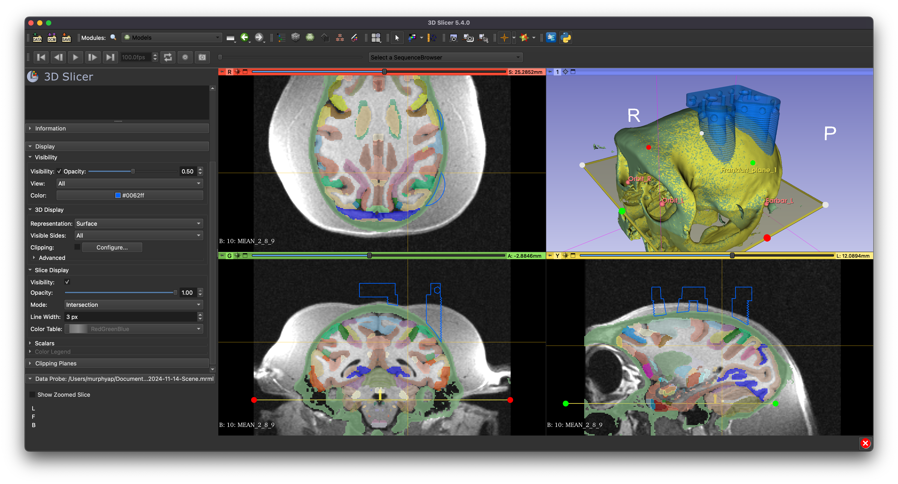

=======================================================
Imaging-Guided Neural Implant Targeting Extensions
=======================================================

**Imaging-Guided Neural Implant Targeting Extensions** (IGNITE) is a Python-based suite of functions designed to help neuroscientists harness multiple existing open-source software in order create customized neural implants for experimental research. This site documents some of the available functions, and guides new users through the entire process.

- :fa:`download` Installation
- :fa:`brain` Image processing
- :fa:`ruler-combined` Implant design
- :fa:`wrench` Implant customization
- :fa:`python` Modifying code

:fa:`forward` Processes
===========================

.. grid:: 5
   :gutter: 2

   .. grid-item::

      .. card::
         :class-card: sd-bg-success sd-text-white sd-rounded-3
         :link: Install
         :link-type: ref
      
         :fa:`download` Installation 

   .. grid-item::

      .. card::
         :class-card: sd-bg-success sd-text-white sd-rounded-3
         :link: ImageProc
         :link-type: ref
      
         :fa:`brain` Image processing

   .. grid-item::

      .. card::
         :class-card: sd-bg-success sd-text-white sd-rounded-3
         :link: Design
         :link-type: ref
      
         :fa:`ruler-combined` Implant design

   .. grid-item::

      .. card::
         :class-card: sd-bg-success sd-text-white sd-rounded-3
         :link: Customize
         :link-type: ref

         :fa:`wrench` Implant customization

   .. grid-item::

      .. card::
         :class-card: sd-bg-success sd-text-white sd-rounded-3
         :link: code
         :link-type: ref

         :fa:`python` Modifying code

:fa:`link` Resources
=====================

.. grid:: 5
   :gutter: 2

   .. grid-item::

      .. card::
         :class-card: sd-bg-primary sd-text-white sd-rounded-3
         :link: https://github.com/Phenomenal-Cat/IGNITE/
         :link-alt: github.com/Phenomenal-Cat/IGNITE/
      
         :fa:`github` GitHub 

   .. grid-item::

      .. card::
         :class-card: sd-bg-primary sd-text-white sd-rounded-3
         :link: https://app.readthedocs.org/projects/py-ignite/
         :link-alt: app.readthedocs.org/projects/py-ignite
      
         :fa:`book` Documents

   .. grid-item::

      .. card::
         :class-card: sd-bg-primary sd-text-white sd-rounded-3
         :link: https://vimeo
      
         :fa:`video` Tutorials 

   .. grid-item::

      .. card::
         :class-card: sd-bg-primary sd-text-white sd-rounded-3
         :link: https://www.thingiverse.com/
         :link-alt: thingiverse.com

         :fa:`cube` 3D models

   .. grid-item::

      .. card::
         :class-card: sd-bg-primary sd-text-white sd-rounded-3
         :link: https://www.nimh.nih.gov/research/research-conducted-at-nimh/research-areas/research-support-services/nif

         :fa:`envelope` Contact

.. |spacer| image:: _images/spacer.png
   :height: 2px
   :class: no-scaled-link

:fa:`unlock` Software
====================================

IGNITE consists of :fa:`python` Python code that uses modules associated with various :fa:`unlock` open-source software.

.. grid:: 3
   :gutter: 2
   :margin: 0

   .. grid-item::

      .. card::
         :class-card: sd-bg-secondary sd-text-dark sd-rounded-3 sd-border-0
         :margin: 1
         :class-header: sd-bg-success sd-rounded-3
         :class-footer: sd-bg-dark

         .. image:: _images/Logos/Slicer_Logo.svg
            :align: left
            :height: 80px
            :target: https://www.slicer.org
            :alt: Slicer Logo

         ^^^
         .. image:: _images/Screenshots/Slicer/Slicer_CT-MR_reg.png
            :align: left
            :width: 100%
            :target: Slicer
            :alt: Slicer screenshot

         Slicer is an open-source, cross-platform 3D medical imaging software that is Python scriptable. 

         +++
         .. image:: _images/Logos/Slicer_Icon.svg
            :height: 30px
            :target: www.slicer.org

         .. image:: _images/Logos/GitHub_Icon_w.svg
            :height: 30px
            :target: https://github.com/Slicer/Slicer

         .. image:: _images/Logos/Wikipedia_Logo_w.svg
            :height: 30px
            :target: https://www.slicer.org/wiki/Main_Page

         .. image:: _images/Logos/Discourse_Icon.svg
            :height: 30px
            :target: https://discourse.slicer.org/

         .. image:: _images/Logos/BSD_Icon.svg
            :height: 30px
            :target: https://www.slicer.org/commercial-use.html

   .. grid-item::

      .. card::
         :class-card: sd-bg-secondary sd-text-dark sd-rounded-3 sd-border-0
         :class-header: sd-bg-primary  sd-rounded-3
         :class-footer: sd-bg-dark
         :margin: 1

         .. image:: _images/Logos/Freecad_Logo.svg
            :align: left
            :height: 80px
            :target: https://www.freecad.org
            :alt: FreeCAD Logo

         ^^^
         .. image:: _images/Screenshots/FreeCAD/FreeCAD_Screenshot.png
            :align: left
            :width: 100%
            :target: https://www.freecad.org
            :alt: FreeCAD screenshot

         FreeCAD is an open-source, cross-platform Computer Aided Design (CAD) software that is Python scriptable. 
          
         +++
         .. image:: _images/Logos/Freecad_Icon.svg
            :height: 30px
            :target: https://www.slicer.org

         .. image:: _images/Logos/GitHub_Icon_w.svg
            :height: 30px
            :target: https://github.com/FreeCAD/FreeCAD

         .. image:: _images/Logos/Wikipedia_Logo_w.svg
            :height: 30px
            :target: https://wiki.freecad.org/

         .. image:: _images/Logos/SpeechBubble_Icon_w.svg
            :height: 30px
            :target: https://forum.freecad.org/

         .. image:: _images/Logos/LGPLv3_Logo.svg
            :height: 30px
            :target: https://wiki.freecad.org/license

   .. grid-item::

      .. card:: 
         :class-card: sd-bg-secondary sd-text-dark sd-rounded-3 sd-border-0
         :class-header: sd-bg-warning  sd-rounded-3
         :class-footer: sd-bg-dark
         :margin: 1

         .. image:: _images/Logos/Blender_Logo.svg
            :align: left
            :height: 80px
            :target: https://www.blender.org
            :alt: Blender Logo

         ^^^
         .. image:: _images/Screenshots/Blender/Blender_screenshot.png
            :align: left
            :width: 100%
            :target: https://www.blender.org
            :alt: Blender screenshot

         Blender is an open-source, cross-platform 3D modeling and animation software that is Python scriptable. 
          
         +++
         .. image:: _images/Logos/Blender_Icon.svg
            :height: 30px
            :target: https://www.blender.org

         .. image:: _images/Logos/GitHub_Icon_w.svg
            :height: 30px
            :target: https://github.com/blender/blender

         .. image:: _images/Logos/Wikipedia_Logo_w.svg
            :height: 30px
            :target: https://docs.blender.org/

         .. image:: _images/Logos/StackExchange_Icon.svg
            :height: 30px
            :target: https://blender.stackexchange.com/

         .. image:: _images/Logos/GPLv3_Logo.svg
            :height: 30px
            :target: https://www.blender.org/about/license/

Background
===============

IGNITE has been developed by researchers in the `Neurophysiology Imaging Facility (NIF) <https://www.nimh.nih.gov/research/research-conducted-at-nimh/research-areas/research-support-services/nif>`_ Core at the `National Institutes of Health (NIH) <https://www.nih.gov/>`_. The complete pipeline was developed to facilitate a specific method for longitudinal extracellular neuronal recordings, which was developed in the laboratory of Dr David Leopold at the NIH over the last decade. 

.. toctree::
   :maxdepth: 2
   :hidden:

    Slicer <Slicer>
    FreeCAD <FreeCAD>
    Blender <Blender>
    Microwire Arrays <MicrowireArrays>

