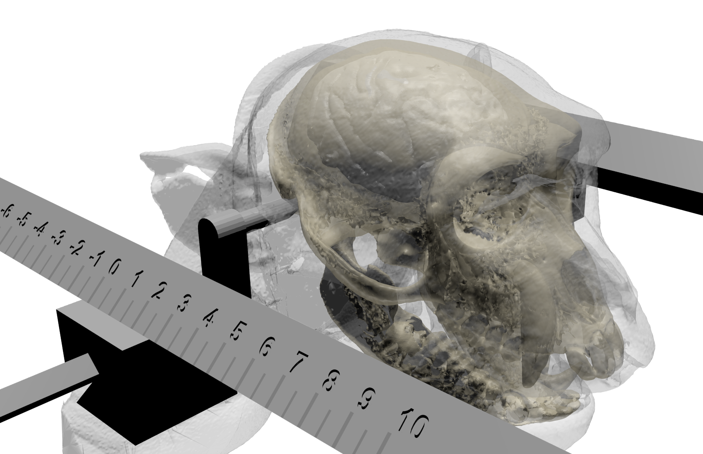

=======================================================
Imaging-Guided Neural Implant Targeting Extensions
=======================================================

Imaging-Guided Neural Implant Targeting Extensions (**IGNITE**) is a :fab:`python;sd-text-primary` :bdg-link-primary:`Python <https://www.python.org>`-based toolbox of functions designed to help neuroscientists harness multiple existing :fas:`unlock;sd-text-success` :bdg-link-success:`open-source <https://opensource.org/>` software in order to **create customized neural implants for experimental research**. For maximum customization and surgical precision, the process uses anatomical **magnetic resonance imaging** :bdg-primary:`MRI` and **computer tomography** :bdg-primary:`CT` volumes, at least one of which should be acquired with the anesthetized subject held in a :ref:`stereotaxic frame <stereotax>`. This site documents some of the available functions, and guides new users through the entire process. 

.. contents:: :local:

:fa:`forward` Processes
===========================

.. grid:: 5
   :gutter: 2

   .. grid-item-card::
      :class-card: sd-bg-primary sd-text-white sd-rounded-3
      :link: Installation
      :link-type: doc
      :text-align: center
   
      :fa:`download` Installation 

   .. grid-item-card::
      :class-card: sd-bg-primary sd-text-white sd-rounded-3
      :link: ImageProcessing
      :link-type: doc
      :text-align: center
   
      :fa:`brain` Image processing

   .. grid-item-card::
      :class-card: sd-bg-primary sd-text-white sd-rounded-3
      :link: ImplantDesign
      :link-type: doc
      :text-align: center
   
      :fa:`ruler-combined` Implant design

   .. grid-item-card::
      :class-card: sd-bg-primary sd-text-white sd-rounded-3
      :link: ImplantCustomization
      :link-type: doc
      :text-align: center

      :fa:`wrench` Implant customization

   .. grid-item-card::
      :class-card: sd-bg-primary sd-text-white sd-rounded-3
      :link: Code
      :link-type: doc
      :text-align: center

      :fab:`python` Modifying code

.. _Dependencies:

:fa:`unlock` Software Dependencies
====================================

.. grid:: 3
   :gutter: 1
   :margin: 0
   :padding: 0

   .. grid-item-card::
      :margin: 0
      :columns: 4
      :class-card: sd-bg-secondary sd-text-dark sd-rounded-3 sd-border-0
      :class-header: sd-bg-success sd-rounded-3
      :class-footer: sd-bg-dark

      .. image:: _images/Logos/Slicer_Logo.svg
         :align: left
         :height: 50px
         :target: https://www.slicer.org
         :alt: Slicer Logo

      ^^^
      **3D medical imaging**

      .. image:: _images/Screenshots/Slicer/Slicer_CT-MR_reg.png
         :align: left
         :width: 100%
         :target: Slicer
         :alt: Slicer screenshot

      +++
      .. image:: _images/Logos/Slicer_Icon.svg
         :height: 30px
         :target: www.slicer.org

      .. image:: _images/Logos/GitHub_Icon_w.svg
         :height: 30px
         :target: https://github.com/Slicer/Slicer

      .. image:: _images/Logos/Wikipedia_Logo_w.svg
         :height: 30px
         :target: https://www.slicer.org/wiki/Main_Page

      .. image:: _images/Logos/Discourse_Icon.svg
         :height: 30px
         :target: https://discourse.slicer.org/

      .. image:: _images/Logos/BSD_Icon.svg
         :height: 30px
         :target: https://www.slicer.org/commercial-use.html

   .. grid-item-card::
      :class-card: sd-bg-secondary sd-text-dark sd-rounded-3 sd-border-0
      :class-header: sd-bg-success  sd-rounded-3
      :class-footer: sd-bg-dark
      :margin: 0
      :columns: 4

      .. image:: _images/Logos/Freecad_Logo.svg
         :align: left
         :height: 50px
         :target: https://www.freecad.org
         :alt: FreeCAD Logo

      ^^^
      **Computer Aided Design (CAD)**

      .. image:: _images/Screenshots/FreeCAD/FreeCAD_Screenshot.png
         :align: left
         :width: 100%
         :target: https://www.freecad.org
         :alt: FreeCAD screenshot
       
      +++
      .. image:: _images/Logos/Freecad_Icon.svg
         :height: 30px
         :target: https://www.slicer.org

      .. image:: _images/Logos/GitHub_Icon_w.svg
         :height: 30px
         :target: https://github.com/FreeCAD/FreeCAD

      .. image:: _images/Logos/Wikipedia_Logo_w.svg
         :height: 30px
         :target: https://wiki.freecad.org/

      .. image:: _images/Logos/SpeechBubble_Icon_w.svg
         :height: 30px
         :target: https://forum.freecad.org/

      .. image:: _images/Logos/LGPLv3_Logo.svg
         :height: 30px
         :target: https://wiki.freecad.org/license

   .. grid-item-card::
      :class-card: sd-bg-secondary sd-text-dark sd-rounded-3 sd-border-0
      :class-header: sd-bg-success sd-rounded-3
      :class-footer: sd-bg-dark
      :margin: 0
      :columns: 4

      .. image:: _images/Logos/Blender_Logo.svg
         :align: left
         :height: 50px
         :target: https://www.blender.org
         :alt: Blender Logo

      ^^^
      **3D modeling and animation**
      
      .. image:: _images/Screenshots/Blender/Blender_screenshot.png
         :align: left
         :width: 100%
         :target: https://www.blender.org
         :alt: Blender screenshot
       
      +++
      .. image:: _images/Logos/Blender_Icon.svg
         :height: 30px
         :target: https://www.blender.org

      .. image:: _images/Logos/GitHub_Icon_w.svg
         :height: 30px
         :target: https://github.com/blender/blender

      .. image:: _images/Logos/Wikipedia_Logo_w.svg
         :height: 30px
         :target: https://docs.blender.org/

      .. image:: _images/Logos/StackExchange_Icon.svg
         :height: 30px
         :target: https://blender.stackexchange.com/

      .. image:: _images/Logos/GPLv3_Logo.svg
         :height: 30px
         :target: https://www.blender.org/about/license/

IGNITE consists of :fab:`python` Python code that calls modules provided by various :fas:`unlock;sd-text-success` :bdg-link-success:`open-source <https://opensource.org/>` software. Each of these software programs have been developed by various groups over decades, which means that they all have:

 - :fa:`display` refined **graphical user interfaces**
 - :fab:`windows` :fab:`apple` :fab:`linux` **cross-platform** support
 - :fa:`book` comprehensive online **documentation**
 - :fa:`comments` large and active online **user communities**
 - :fa:`graduation-cap` plentiful online **tutorials** and learning resources

While the task of designing customized neural implants using these software tools can be performed manually, there is a learning curve to navigating each software's graphical user interface (GUI). IGNITE simplifies the process as much as possible, by scripting steps that a user would otherwise have to learn to perform through GUI interactions. Click the icons below to explore resources related to each of the selected software.

:fa:`link` Resources
=====================

.. grid:: 5
   :gutter: 2

   .. grid-item::

      .. card::
         :class-card: sd-bg-primary sd-text-white sd-rounded-3
         :link: https://github.com/Phenomenal-Cat/IGNITE/
         :link-alt: github.com/Phenomenal-Cat/IGNITE/
      
         :fab:`github` GitHub 

   .. grid-item::

      .. card::
         :class-card: sd-bg-primary sd-text-white sd-rounded-3
         :link: https://app.readthedocs.org/projects/py-ignite/
         :link-alt: app.readthedocs.org/projects/py-ignite
      
         :fa:`book` Documents

   .. grid-item::

      .. card::
         :class-card: sd-bg-primary sd-text-white sd-rounded-3
         :link: https://vimeo
      
         :fa:`video` Tutorials 

   .. grid-item::

      .. card::
         :class-card: sd-bg-primary sd-text-white sd-rounded-3
         :link: https://www.thingiverse.com/
         :link-alt: thingiverse.com

         :fa:`cube` 3D models

   .. grid-item::

      .. card::
         :class-card: sd-bg-primary sd-text-white sd-rounded-3
         :link: https://www.nimh.nih.gov/research/research-conducted-at-nimh/research-areas/research-support-services/nif

         :fa:`envelope` Contact

:fa:`landmark` Background
============================

IGNITE has been developed by researchers in the `Neurophysiology Imaging Facility (NIF) <https://www.nimh.nih.gov/research/research-conducted-at-nimh/research-areas/research-support-services/nif>`_ Core at the `National Institutes of Health (NIH) <https://www.nih.gov/>`_. The complete pipeline was developed to facilitate a specific method for longitudinal extracellular neuronal recordings, which was developed at the NIH over the last decade. 

.. toctree::
   :maxdepth: 2
   :hidden:

   Installation
   ImageProcessing
   ImplantDesign
   ImplantCustomization
   MicrowireArrays

